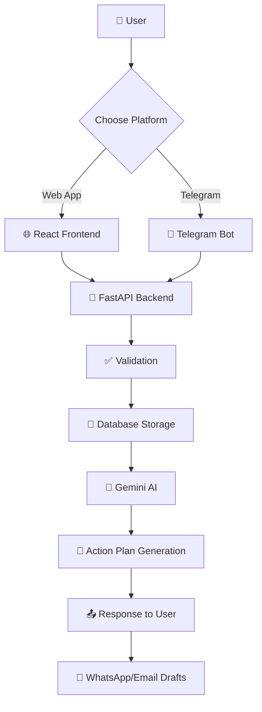
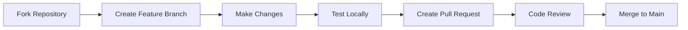

# VishwaGuru

<div align="center">


**Empowering India's youth to engage with democracy through AI-powered civic action** 🚀

[📖 Documentation](#documentation) • [🚀 Quick Start](#installation) • [🤝 Contributing](#development--contribution-guide) • [📋 Issues](https://github.com/Ewocs/VishwaGuru/issues)

---

</div>

## ✨ What is VishwaGuru?

VishwaGuru is an open source platform that **transforms civic engagement** in India. Using cutting-edge AI, it simplifies contacting representatives, filing grievances, and organizing community action. Built specifically for India's diverse languages and governance systems, it turns everyday **selfies and videos into real civic impact**.

> 🎯 **Mission**: Make democracy accessible to every Indian citizen through technology

---

## 🌟 Key Features

<table>
<tr>
<td align="center">

<br>
<strong>AI Action Plans</strong>
<br>
Generates personalized WhatsApp messages and email drafts using Google's Gemini API
</td>
<td align="center">

<br>
<strong>Multi-Platform</strong>
<br>
Report issues via modern web interface or Telegram bot
</td>
<td align="center">

<br>
<strong>Production Ready</strong>
<br>
SQLite for development, PostgreSQL for production
</td>
</tr>
<tr>
<td align="center">

<br>
<strong>Modern Stack</strong>
<br>
React + Vite frontend, FastAPI backend
</td>
<td align="center">

<br>
<strong>India-Centric</strong>
<br>
Built for Indian languages and governance systems
</td>
<td align="center">

<br>
<strong>Open Source</strong>
<br>
Free, transparent, and community-driven
</td>
</tr>
</table>

---

## 🏗️ Architecture & Data Flow

VishwaGuru uses a **unified backend architecture** where a single FastAPI service powers the web frontend, AI services, database operations, and the Telegram bot.

### Architecture Diagrams

📋 **[ARCHITECTURE.md](./ARCHITECTURE.md)** - Complete deployment architecture with ASCII diagrams
- System components and data flow
- Environment configuration
- Deployment topology

> **Note:** Visual architecture diagrams are currently missing. ASCII diagrams are available in [ARCHITECTURE.md](./ARCHITECTURE.md).

### High-Level Flow



### Components Interaction

| Component | Technology | Purpose |
|-----------|------------|---------|
| 🎨 **Frontend** | React + Vite | User interface and interactions |
| ⚙️ **Backend** | FastAPI + Python | API logic, validation, orchestration |
| 🗄️ **Database** | SQLite/PostgreSQL | Issue storage and user data |
| 🤖 **AI Engine** | Google Gemini | Action plan and message generation |
| 📱 **Telegram Bot** | python-telegram-bot | Alternative user interface |

---

## 📋 Prerequisites

<div align="center">

### System Requirements

| Component | Version | Purpose |
|-----------|---------|---------|
| 🐍 **Python** | 3.8+ | Backend runtime |
| ⚛️ **Node.js** | 18+ | Frontend build tools |
| 📦 **npm** | Latest | Package management |
| 🐙 **Git** | 2.0+ | Version control |

</div>

---

## 🚀 Installation

### 1. 📥 Clone the Repository

```bash
git clone https://github.com/Ewocs/VishwaGuru.git
cd vishwaguru
```

### 2. ⚙️ Backend Setup

<div align="center">

#### Backend Configuration Steps

</div>

**Create Virtual Environment:**
```bash
# Linux/macOS
python3 -m venv venv
source venv/bin/activate

# Windows
python -m venv venv
venv\Scripts\activate
```

**Install Dependencies:**
```bash
pip install -r backend/requirements.txt
```

**🔐 Environment Configuration:**
```bash
# Create .env file
cp .env.example .env

# Edit .env with your keys
nano .env  # or your preferred editor
```

**Required Environment Variables:**
```env
TELEGRAM_BOT_TOKEN=your_bot_token_from_botfather
GEMINI_API_KEY=your_api_key_from_google_ai_studio
DATABASE_URL=sqlite:///./data/issues.db  # or PostgreSQL URL
```

### 3. 🎨 Frontend Setup

```bash
cd frontend
npm install
```

---

## 🏃‍♂️ Running Locally

<div align="center">

### Quick Start Commands

| Service | Command | URL |
|---------|---------|-----|
| 🚀 **Backend** | `PYTHONPATH=backend python -m uvicorn main:app --reload` | http://localhost:8000 |
| 🎨 **Frontend** | `cd frontend && npm run dev` | http://localhost:5173 |
| 🤖 **Telegram Bot** | *Starts with backend* | Via Telegram app |

</div>

**📝 Windows Note:** Use `set PYTHONPATH=backend & python -m uvicorn main:app --reload`

---

## ☁️ Deployment Options

<div align="center">

### Choose Your Deployment Platform

| Platform | Frontend | Backend | Database | Difficulty |
|----------|----------|---------|----------|------------|
| 🔥 **Firebase** | Hosting | Cloud Functions | Firestore | 🟢 Easy |
| 🌐 **Netlify + Render** | Netlify | Render | Neon/PostgreSQL | 🟡 Medium |
| 🐙 **Railway** | Built-in | Built-in | Built-in | 🟢 Easy |
| ☁️ **Vercel + Railway** | Vercel | Railway | Railway | 🟡 Medium |

</div>

### Firebase Deployment (Recommended)

```bash
# Install Firebase CLI
npm install -g firebase-tools
firebase login

# Initialize (if needed)
firebase init

# Build and deploy
cd frontend && npm run build && cd ..
firebase deploy
```

### Alternative: Netlify + Render

```bash
# Frontend: Connect to Netlify
# Backend: Deploy to Render
# Database: Use Neon or Supabase
```

---

## 🛠️ Tech Stack

<div align="center">

### Core Technologies

| Category | Technology | Purpose |
|----------|------------|---------|
| 🎨 **Frontend** | React 18, Vite, Tailwind CSS | Modern UI framework |
| ⚙️ **Backend** | Python 3.8+, FastAPI, SQLAlchemy | API and business logic |
| 🗄️ **Database** | SQLite (dev), PostgreSQL (prod) | Data persistence |
| 🤖 **AI/ML** | Google Gemini API | Action plan generation |
| 📱 **Bot** | python-telegram-bot | Alternative interface |
| ☁️ **Deployment** | Firebase, Render, Netlify | Hosting platforms |

</div>

---

## 📚 Documentation

<div align="center">

### 📖 Available Documentation

| Document | Description | Link |
|----------|-------------|------|
| 🏗️ **Architecture** | System design and data flow | [ARCHITECTURE.md](./ARCHITECTURE.md) |
| 🚀 **Deployment** | Step-by-step deployment guides | [DEPLOYMENT_GUIDE.md](./DEPLOYMENT_GUIDE.md) |
| 📋 **API Reference** | Frontend API documentation | [FRONTEND_API_DOCUMENTATION.md](./FRONTEND_API_DOCUMENTATION.md) |
| 🔧 **Quick Reference** | Common commands and tips | [QUICK_REFERENCE.md](./QUICK_REFERENCE.md) |
| 🎨 **Frontend Guide** | Frontend development guide | [frontend/README.md](./frontend/README.md) |
| ⚙️ **Backend Guide** | Backend development guide | [backend/README.md](./backend/README.md) |

</div>

---

## 🤝 Development & Contribution Guide

<div align="center">

### 🌟 Welcome Contributors!

We ❤️ contributions! Here's how to get started:

</div>

### Development Workflow



### 📋 Contribution Steps

1. 🍴 **Fork** the repository
2. 🌿 **Create** a feature branch: `git checkout -b feature/amazing-feature`
3. 💻 **Develop** your changes
4. 🧪 **Test** thoroughly
5. 📝 **Commit** with clear messages
6. 🔄 **Push** to your fork
7. 📤 **Create** a Pull Request

### 🐛 Issue Reporting

Found a bug? Have a feature request?

- 🐛 **[Bug Reports](https://github.com/Ewocs/VishwaGuru/issues/new?template=bug_report.md)**
- ✨ **[Feature Requests](https://github.com/Ewocs/VishwaGuru/issues/new?template=feature_request.md)**
- 🤔 **[Questions](https://github.com/Ewocs/VishwaGuru/discussions)**

### 📊 Project Status

[](https://github.com/Ewocs/VishwaGuru/issues)
[](https://github.com/Ewocs/VishwaGuru/pulls)
[](https://github.com/Ewocs/VishwaGuru/stargazers)

---

## 📄 License

<div align="center">

**VishwaGuru** is licensed under the **GNU Affero General Public License v3.0**

[](https://www.gnu.org/licenses/agpl-3.0)

*This program is free software: you can redistribute it and/or modify it under the terms of the GNU Affero General Public License as published by the Free Software Foundation, either version 3 of the License, or (at your option) any later version.*

</div>

---

<div align="center">

### 🌟 Made with ❤️ for India's Democracy

**Connect with us:**
[](https://github.com/Ewocs/VishwaGuru)
[](https://x.com/rohan_critic)
[](https://www.linkedin.com/in/rohanvijaygaikwad)

---

*⭐ Star this repository if you find it helpful!*

</div>

### 1. 📥 Clone the Repository

```bash
git clone https://github.com/Ewocs/VishwaGuru.git
cd vishwaguru
```

### 2. ⚙️ Backend Setup

<div align="center">

#### Backend Configuration Steps

</div>

**Create Virtual Environment:**
```bash
# Linux/macOS
python3 -m venv venv
source venv/bin/activate

# Windows
python -m venv venv
venv\Scripts\activate
```

**Install Dependencies:**
```bash
pip install -r backend/requirements.txt
```

**🔐 Environment Configuration:**
```bash
# Create .env file
cp .env.example .env

# Edit .env with your keys
nano .env  # or your preferred editor
```

**Required Environment Variables:**
```env
TELEGRAM_BOT_TOKEN=your_bot_token_from_botfather
GEMINI_API_KEY=your_api_key_from_google_ai_studio
DATABASE_URL=sqlite:///./data/issues.db  # or PostgreSQL URL
```

### 3. 🎨 Frontend Setup

```bash
cd frontend
npm install
```

---

## 🏃‍♂️ Running Locally

<div align="center">

### Quick Start Commands

| Service | Command | URL |
|---------|---------|-----|
| 🚀 **Backend** | `PYTHONPATH=backend python -m uvicorn main:app --reload` | http://localhost:8000 |
| 🎨 **Frontend** | `cd frontend && npm run dev` | http://localhost:5173 |
| 🤖 **Telegram Bot** | *Starts with backend* | Via Telegram app |

</div>

**📝 Windows Note:** Use `set PYTHONPATH=backend & python -m uvicorn main:app --reload`

---

## ☁️ Deployment Options

<div align="center">

### Choose Your Deployment Platform

| Platform | Frontend | Backend | Database | Difficulty |
|----------|----------|---------|----------|------------|
| 🔥 **Firebase** | Hosting | Cloud Functions | Firestore | 🟢 Easy |
| 🌐 **Netlify + Render** | Netlify | Render | Neon/PostgreSQL | 🟡 Medium |
| 🐙 **Railway** | Built-in | Built-in | Built-in | 🟢 Easy |
| ☁️ **Vercel + Railway** | Vercel | Railway | Railway | 🟡 Medium |

</div>

### Firebase Deployment (Recommended)

```bash
# Install Firebase CLI
npm install -g firebase-tools
firebase login

# Initialize (if needed)
firebase init

# Build and deploy
cd frontend && npm run build && cd ..
firebase deploy
```

### Alternative: Netlify + Render

```bash
# Frontend: Connect to Netlify
# Backend: Deploy to Render
# Database: Use Neon or Supabase
```

---

## 🛠️ Tech Stack

<div align="center">

### Core Technologies

| Category | Technology | Purpose |
|----------|------------|---------|
| 🎨 **Frontend** | React 18, Vite, Tailwind CSS | Modern UI framework |
| ⚙️ **Backend** | Python 3.8+, FastAPI, SQLAlchemy | API and business logic |
| 🗄️ **Database** | SQLite (dev), PostgreSQL (prod) | Data persistence |
| 🤖 **AI/ML** | Google Gemini API | Action plan generation |
| 📱 **Bot** | python-telegram-bot | Alternative interface |
| ☁️ **Deployment** | Firebase, Render, Netlify | Hosting platforms |

</div>

---

## 📚 Documentation

<div align="center">

### 📖 Available Documentation

| Document | Description | Link |
|----------|-------------|------|
| 🏗️ **Architecture** | System design and data flow | [ARCHITECTURE.md](./ARCHITECTURE.md) |
| 🚀 **Deployment** | Step-by-step deployment guides | [DEPLOYMENT_GUIDE.md](./DEPLOYMENT_GUIDE.md) |
| 📋 **API Reference** | Frontend API documentation | [FRONTEND_API_DOCUMENTATION.md](./FRONTEND_API_DOCUMENTATION.md) |
| 🔧 **Quick Reference** | Common commands and tips | [QUICK_REFERENCE.md](./QUICK_REFERENCE.md) |
| 🎨 **Frontend Guide** | Frontend development guide | [frontend/README.md](./frontend/README.md) |
| ⚙️ **Backend Guide** | Backend development guide | [backend/README.md](./backend/README.md) |

</div>


### 📋 Contribution Steps

1. 🍴 **Fork** the repository
2. 🌿 **Create** a feature branch: `git checkout -b feature/amazing-feature`
3. 💻 **Develop** your changes
4. 🧪 **Test** thoroughly
5. 📝 **Commit** with clear messages
6. 🔄 **Push** to your fork
7. 📤 **Create** a Pull Request

### 🐛 Issue Reporting

Found a bug? Have a feature request?

- 🐛 **[Bug Reports](https://github.com/Ewocs/VishwaGuru/issues/new?template=bug_report.md)**
- ✨ **[Feature Requests](https://github.com/Ewocs/VishwaGuru/issues/new?template=feature_request.md)**
- 🤔 **[Questions](https://github.com/Ewocs/VishwaGuru/discussions)**

### 📊 Project Status

[](https://github.com/Ewocs/VishwaGuru/issues)
[](https://github.com/Ewocs/VishwaGuru/pulls)
[](https://github.com/Ewocs/VishwaGuru/stargazers)

---

## 📄 License

<div align="center">

**VishwaGuru** is licensed under the **GNU Affero General Public License v3.0**

[](https://www.gnu.org/licenses/agpl-3.0)

*This program is free software: you can redistribute it and/or modify it under the terms of the GNU Affero General Public License as published by the Free Software Foundation, either version 3 of the License, or (at your option) any later version.*

</div>

---


fix-ui-setup-docs
This project is licensed under the **AGPL-3.0** License.
 
 ## 🛠️ Project Setup (Local)

### Prerequisites
- Node.js v18 or above
- npm (comes with Node.js)
- Git

Check versions:
```bash
node -v
npm -v
 
